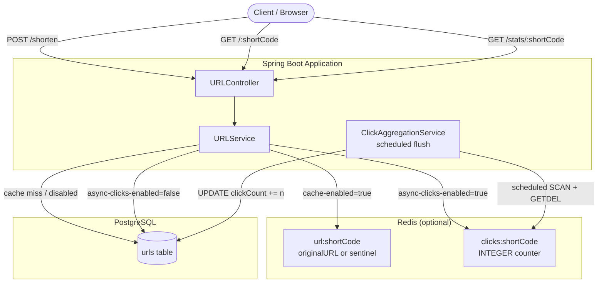
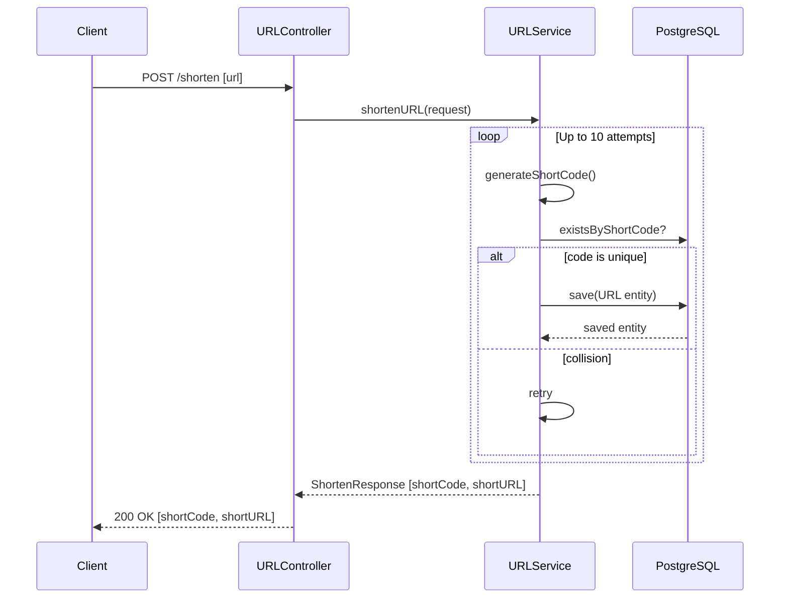
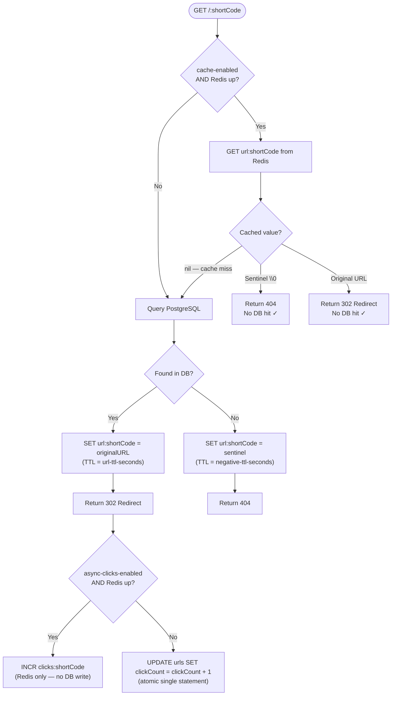

# URL Shortener

A production-grade URL shortening service built with **Spring Boot 4**, **PostgreSQL**, and an optional **Redis** acceleration layer. The service is designed for high read throughput, featuring atomic click counting, a read-through cache, negative caching, and an asynchronous click-aggregation pipeline.

---

## Table of Contents

- [Features](#features)
- [Tech Stack](#tech-stack)
- [Architecture Overview](#architecture-overview)
- [API Reference](#api-reference)
- [Data Flow Diagrams](#data-flow-diagrams)
  - [URL Shortening](#url-shortening-flow)
  - [URL Redirect (with cache)](#url-redirect-flow)
  - [Async Click Aggregation](#async-click-aggregation-flow)
- [Configuration](#configuration)
- [Feature Flags](#feature-flags)
- [Running Locally](#running-locally)
- [Running Tests](#running-tests)

---

## Features

| Feature | Description |
|---|---|
| **URL Shortening** | Generates a unique short code and persists the mapping |
| **Redirect** | 302 redirect from short code to original URL |
| **Click tracking** | Atomic DB increment (Phase 0) or async Redis counter (Phase 2) |
| **Read-through cache** | Redis cache for `shortCode → originalURL` with configurable TTL |
| **Negative caching** | Sentinel entry stored for non-existent short codes, preventing repeated DB hits |
| **Async aggregation** | Scheduled flush of Redis click counters to PostgreSQL |
| **Stats endpoint** | Per-URL click count, original URL, and creation timestamp |
| **Traffic simulation tests** | Concurrent integration tests validating correctness under load |

---

## Tech Stack

- **Java 21** + **Spring Boot 4**
- **PostgreSQL** — persistent URL store
- **H2** — in-memory DB for tests
- **Redis** (optional) — read-through cache + async click counter
- **Hibernate / Spring Data JPA** — ORM
- **HikariCP** — connection pooling
- **JUnit 5 + Mockito** — unit & integration tests

---

## Architecture Overview



---

## API Reference

### `POST /shorten`

Shortens a URL and returns the short code.

**Request body**
```json
{ "url": "https://example.com/very/long/path" }
```

**Response `200 OK`**
```json
{
  "shortCode": "aB3xYz",
  "shortURL": "http://localhost:8080/aB3xYz"
}
```

---

### `GET /{shortCode}`

Redirects to the original URL.

| Status | Meaning |
|---|---|
| `302 Found` | Redirect to original URL (Location header set) |
| `404 Not Found` | Short code does not exist |

---

### `GET /stats/{shortCode}`

Returns metadata for a short code.

**Response `200 OK`**
```json
{
  "shortCode": "aB3xYz",
  "originalURL": "https://example.com/very/long/path",
  "clickCount": 42,
  "createdAt": "2026-01-15T10:30:00"
}
```

| Status | Meaning |
|---|---|
| `200 OK` | Stats returned |
| `404 Not Found` | Short code does not exist |

---

## Data Flow Diagrams

### URL Shortening Flow



---

### URL Redirect Flow

This diagram shows all three lookup paths: negative cache hit, positive cache hit, and DB fallback.



---

### Async Click Aggregation Flow

When `feature.async-clicks-enabled=true`, click counts are first written to Redis and flushed to PostgreSQL on a schedule.

```mermaid
sequenceDiagram
    participant Redirect as Redirect Path
    participant Redis
    participant Aggregator as ClickAggregationService
    participant DB as PostgreSQL

    Note over Redirect,Redis: Per-redirect — no DB write
    Redirect->>Redis: INCR clicks:shortCode

    Note over Aggregator,DB: Every flush-interval-ms
    Aggregator->>Redis: SCAN clicks:* (cursor-based, non-blocking)
    Redis-->>Aggregator: matching keys

    Aggregator->>Redis: Pipeline GETDEL for all keys
    Redis-->>Aggregator: counter values (keys deleted)

    alt DB write succeeds
        Aggregator->>DB: UPDATE clickCount += n (per shortCode)
        DB-->>Aggregator: rows updated
    else DB write fails (transient outage)
        Aggregator->>Redis: INCRBY clicks:shortCode n (restore drained values)
        Note right of Aggregator: Clicks preserved; next cycle retries
    end
```

---

## Configuration

All settings are in `src/main/resources/application.yml`. Environment variables (shown in parentheses) override defaults.

```yaml
feature:
  cache-enabled: true              # (FEATURE_CACHE_ENABLED) Redis read-through cache + negative cache
  async-clicks-enabled: true       # (FEATURE_ASYNC_CLICKS_ENABLED) async Redis click tracking

app:
  cache:
    url-ttl-seconds: 3600          # (APP_CACHE_URL_TTL_SECONDS) positive cache TTL
    negative-ttl-seconds: 300      # (APP_CACHE_NEGATIVE_TTL_SECONDS) negative cache TTL

  click-aggregation:
    flush-interval-ms: 10000       # (APP_CLICK_AGGREGATION_FLUSH_INTERVAL_MS) aggregation schedule

  datasource:
    pool:
      maximum-size: 20
      minimum-idle: 5
      auto-commit: false           # required — Hibernate owns transaction boundaries

spring:
  data:
    redis:
      host: ${REDIS_HOST:localhost}
      port: ${REDIS_PORT:6379}
```

---

## Feature Flags

| Flag | Default | Effect when `true` |
|---|---|---|
| `feature.cache-enabled` | `true` | Redis read-through cache for redirect lookups; negative caching for missing codes |
| `feature.async-clicks-enabled` | `true` | Click increments go to Redis (INCR); `ClickAggregationService` flushes to DB on schedule |

Both flags can be set independently. With both disabled the service runs in a stateless mode (PostgreSQL only).

---

## Running Locally

### Prerequisites

- Java 21
- Docker (for PostgreSQL + Redis)

### Start infrastructure

```bash
docker-compose up -d
```

### Run the application

```bash
./mvnw spring-boot:run
```

The server starts on `http://localhost:8080`.

### Example requests

```bash
# Shorten a URL
curl -s -X POST http://localhost:8080/shorten \
  -H 'Content-Type: application/json' \
  -d '{"url":"https://example.com/very/long/path"}' | jq .

# Redirect (follow with -L)
curl -Ls -o /dev/null -w '%{url_effective}' http://localhost:8080/<shortCode>

# Stats
curl -s http://localhost:8080/stats/<shortCode> | jq .
```

---

## Running Tests

```bash
# All tests (H2 in-memory, no Redis required)
./mvnw test

# Unit tests only
./mvnw test -pl . -Dtest="URLServiceTest,URLControllerTests,URLServiceTests"

# Traffic simulation (concurrent load scenarios)
./mvnw test -Dtest="TrafficSimulationTest"
```

The test profile (`application-test.yml`) excludes Redis auto-configuration entirely, so no Redis instance is needed to run the test suite.
